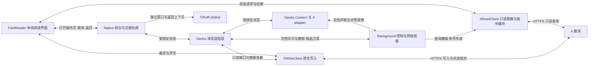

# RFC-001: Gecko 辅助会话通信与阅读器交接

> 2026-09-13 登录实现更新：登录已迁入独立 `LoginActivity`/`LoginFlow`，
> `restoreLogin/googleAuth` 及自定义 DOM 登录入口已移除，当前行为见
> [原生登录架构验收](../validation/native-authentication.md)。本文其余通信协议仍为提案，未整体实施。

| 元数据 | 内容 |
| :--- | :--- |
| RFC 编号 | RFC-001 |
| 英文名称 | Gecko Session Messaging and Reader Handoff |
| 状态 | Proposed（架构修订；文档身份与传输方案待实验定案，尚未实施） |
| 涉及模块 | `BrowserActivity`、`NavigationBridge`、`FastReader`、`XReadClient`、`XWriteClient`、`TvXApplication`、`TvKeyRouter`、扩展 runtime / bootstrap / adapter、通信与交互测试 |
| 创建日期 | 2026-09-09 |
| 更新日期 | 2026-09-10 |

本文替代原“首页／详情各自一个 GeckoSession、全部 Native 业务直连”的设计。文件路径保留，避免破坏已有引用。当前应用已采用原生读取与本地阅读器，并独立接入原生喜欢／取消喜欢／纯文本回复；本 RFC 负责该阅读器与 Gecko 登录／操作页之间的消息、前台所有权和交接可靠性。既有性能实现与本 RFC 的目标协议分别验收。

## 一、决策与范围

### 1.1 本次确定的架构边界

1. 首页、详情和评论阅读继续使用 `XReadClient + FastReader`。不为打开每条帖子创建 GeckoSession，不把 Gecko 文档加载或消息握手重新放回正常阅读首屏的依赖链。
2. 阅读器中的喜欢／取消喜欢与纯文本回复交给 `XWriteClient`，评论输入框属于 Native；不为这些动作导航到原帖。Gecko 承担登录、当前接口元数据准备、外链及首次建立查询模板时的浏览路径。显式进入原网站时保留其旧交互；OAuth popup 保持独立窗口边界。
3. Native 明确管理前台界面和单次交接。阅读器、Gecko 和 popup 的按键、焦点、触摸及展示权限不能只由一个 `activeSession()` 或扩展 tab 的 active 状态决定。
4. Background 保留成功只读请求模板、退出／账号状态观察、旧网页点赞网络观察，并转发有请求编号的只读写接口元数据准备。文档身份仲裁的优先实验也放在 Background；它不再按 `active || tabs[0]` 猜测业务目的地。
5. 来源验证、原连接回复、幂等就绪确认、迟到回调隔离、有界恢复及不自动重放用户动作是必要约束。是否使用 Content 业务直连，要在文档身份实验后比较总复杂度再定案。

### 1.2 实施范围与明确排除项

本 RFC 定义前台协调、阅读器交接、Gecko 文档／连接身份、Background 控制消息、失败恢复和迁移验收。数据层只列必须保持的接口与账号失效约束；查询解析、完整正文判定及缓存实现详见 [直接取数阅读器验证](../validation/xtv-fast-reader-20260909.md)。

原生写 API 已作为独立性能工作接入，本 RFC 不重新设计其 HTTP 事务或 OAuth 授权，不建立通用 RPC、通用在途请求队列或每个按键的 ACK。Gecko 前台的可信键盘输入与媒体用户激活继续保留。`TvKeyRouter` 仅按实际调用点清理；仍可达的 BACK 分支不能按死代码删除。

传输方案、文档仲裁与交接协议均为目标设计。本文修订不意味着它们已进入 APK，也不意味着原始遮罩故障已找到唯一根因。

## 二、当前实现与已有证据

### 2.1 当前基线

| 层 | 已实现行为 | 本 RFC 要补的边界 |
| :--- | :--- | :--- |
| `XReadClient` / `TvXApplication` | 利用已捕获模板发起原生只读请求，提前请求首页；账号绑定的加密完整缓存、取消在途请求 | 控制通道恢复、旧账号模板与迟到退出通知的顺序保证 |
| `XWriteClient` | 原生白名单 HTTP 写请求、账号快照检查、单次提交、喜欢读回、回复不明结果持久标记 | 元数据冷启动和失效更新、多文档／账号控制顺序的完整验收 |
| `FastReader` / 本地 `reader/` | 本地渲染、评论分页、媒体与历史；本地动作菜单、原生评论框、草稿与成功状态回写；隔离过期响应 | 与 Gecko 的交接身份、取消、失败与返回契约 |
| `BrowserActivity` | 先展示阅读器，延后建立 Gecko；单个主 GeckoSession 加 OAuth popup | 集中的前台所有权；避免隐藏 Gecko 的回调影响阅读器 |
| `NavigationBridge` / Background | 现有全局 Native Port 中继仍在；接收模板、退出、页面状态及阅读器操作消息 | 移除目标猜测，区分控制来源与 Content 来源，补连接和文档许可 |
| Content / adapter | `readerAction` 打开目标帖子与操作，发送 `reader_browser_ready/return` | 当前 ready 主要按路径匹配，需要关联一次交接及动作阶段 |

源码入口：[BrowserActivity](../../app/src/main/java/cn/deeloo/tvxbrowser/BrowserActivity.java)、[NavigationBridge](../../app/src/main/java/cn/deeloo/tvxbrowser/NavigationBridge.java)、[FastReader](../../app/src/main/java/cn/deeloo/tvxbrowser/FastReader.java)、[XReadClient](../../app/src/main/java/cn/deeloo/tvxbrowser/XReadClient.java)、[background.js](../../app/src/main/assets/tv-extension/runtime/background.js)。

### 2.2 实测支持的结论

- 原先首页约 21.4 秒、详情完整正文约 10.7 秒。移除独立详情 Session、直接取数、本地渲染、完整内容复用与缓存是本轮性能变化的来源，不能归功于尚未实施的 SessionController 迁移。
- 最终连续 5 轮：首页完整缓存可读 2.783–3.207 秒，本次更新 3.823–4.780 秒；详情完整正文复用 0.563–0.964 秒，本次更新 2.013–3.127 秒。无完整缓存／正文、首次登录及网络波动仍可能超过 5 秒。完整可读与本次网络更新分开报告，见 [性能证据与限制](../validation/xtv-fast-reader-20260909.md)。
- 固定 GeckoView `155.0.20260903215306` 的 Content → SessionController Native Port 在投影仪可用，`sender.session` 能定位 Session。
- 同 Session、同 URL 的慢 reload 中，新导航 `onPageStart` 后，旧文档仍成功重连，且 `getFrame` 返回 current。Session 身份不等于最新导航文档身份；随机 UUID、URL 相等、最后连入或一次 current 查询均不能消除这个反例。
- 旧 APK 的 10 次观测冷启动均成功揭幕；Native 收到 ready 至 View.GONE 回调为 14–30ms。原始 DOM 已就绪却仍有遮罩的故障存在现场证据，但首次失败链未捕获，不能认定所有等待都由消息中继造成。
- 实体方向／确认／菜单的可信键路径、一次实体短按 BACK 返回时间线、data 资产静态注入、BFCache、Activity 重建和 popup 打开／关闭已取得有限样本。mock 的隐藏关闭按钮误消费 BACK 也已复现。完整 OAuth 授权、实体 BACK 的其余分支和长期故障恢复未因此通过。

后四项的版本、时序与证据边界见 [实机可行性报告](../validation/rfc-001-feasibility.md) 和 [固定 GeckoView 源码研究](../validation/rfc-001-geckoview-source-evidence.md)。这些旧 APK 研究不替代新阅读器架构的回归。

### 2.3 原生写入与本 RFC 的关系（2026-09-10）

`FastReader → XWriteClient → X HTTPS` 是阅读器写动作的新路径。`NavigationBridge → Background → write-api.js` 仅准备当前 queryId、布尔功能配置和逐次事务标识；正文、目标帖子与写操作由 Native 决定，会话认证头不进入阅读 WebView。

现有准备协议以 UUID 对应唯一待处理回调，3 秒超时，结果仅接收当前 Background Port；账号快照与 CSRF 必须匹配。Content 通过 Firefox 的 `wrappedJSObject` 读取已加载网页模块，不执行点赞或发布。写请求无 DOM 自动回退，回复未知结果保留草稿及本地指纹，禁止自动重发。

此实现仍使用既有全局 Background Port，准备时选择 X 主页或首个 X tab；该选择只用于读取元数据，不能证明 RFC 的文档许可、多窗口绑定或控制消息顺序已实现。已就绪 Gecko 的接口准备已验证，冷启动时立即操作可能返回“登录会话正在准备”，不得宣称这条路径完全不依赖 Gecko。

本地原生写操作不属于下文 reader_prepare / reader_execute 的 Gecko 前台交接；这些交接协议继续约束确实需要打开网页的动作。接口级验证见 [直接写接口报告](../validation/xtv-direct-write-api-20260910.md)，APK 接入验收见 [原生写入 APK 验证](../validation/xtv-native-write-apk-20260910.md)。

## 三、目标职责与前台所有权

### 3.1 职责图

下图表示逻辑职责；“受绑定消息”采用直连还是明确寻址的 Background 传输，在 §4 实验后定案。

以上是责任划分，不要求立刻创建同名类或多个管理框架。可先从 `BrowserActivity` 提取一个可测试的小型协调对象，统一原来分散的可见性布尔值与回调校验。Bridge 处理传输和已验证的来源，不能直接决定隐藏哪个 View 或退出 Activity。

### 3.2 前台与交接状态

Native 保存以下相互独立的状态：

| 状态 | 所属与用途 |
| :--- | :--- |
| `foregroundSurface` | `reader`、`gecko` 或 `oauthPopup`；等待 UI 归属于发起界面，不另造一个 GeckoSession |
| `surfaceGeneration` | Native 在交接、取消、popup 切换及暂停／恢复时推进，失效旧焦点、触摸、展示和计时回调 |
| `handoffId` | Native 每次明确打开 Gecko 操作页时生成；同时最多一个；关联账号代次、目标帖子／URL、动作及阅读返回位置 |
| Gecko 绑定 | Session 对象、已验证文档与 Port 身份；与前台界面身份分开保存 |
| `accountGeneration` | 数据层管理的账号／登录上下文代次；账号变化使旧数据、模板候选和交接失效，不由页面刷新推进 |
| 阅读请求标识 | 保留 FastReader 现有请求与场景隔离，不复用 Gecko 文档代次或 handoffId |

普通用户输入只属于当前前台。隐藏 Gecko 可以预热、接受模板观察、保存自身最新状态；它的 ready 不得隐藏阅读器，tap／exit 不得对阅读器或其他界面产生副作用。

`reader → preparingGecko` 时阅读器仍为前台，保留内容和取消入口。协调层可以向明确选定的 Gecko 绑定发送准备目标路由的控制指令；这是受当前 handoffId 约束的准备工作，不能借此向隐藏页面派发任意用户输入或合成触摸。

所有会改变 UI 的异步回调入队时捕获相关身份，执行时再次核验。仅在收到消息时检查一次不够。账号切换、Session 关闭和 Activity 销毁必须取消对应任务及交接。

### 3.3 按键与返回归属

| 场景 | 目标职责 |
| :--- | :--- |
| 阅读器前台 | FastReader 处理方向、确认、菜单、媒体及阅读返回；不向后台 Gecko 镜像发送按键 |
| 阅读器等待 Gecko | 保留等待提示，BACK 由 Native 立即取消；不依赖 Port 回执；其他键不泄漏给隐藏页面 |
| Gecko adapter 前台 | 保留 `GeckoView.dispatchKeyEvent()` 的可信事件、按下／抬起配对和 repeatCount；MENU / BACK 沿已验证映射处理可见覆盖层 |
| Gecko 普通网页／mock / probe | 迁移前分别定义历史返回、关闭操作页及资产滚动／覆盖层行为；消除隐藏按钮误消费，不把超时当作 Web 未处理 |
| Gecko 加载或错误界面 | Native 管理重试与返回；存在阅读来源时恢复阅读器，首次登录等无阅读来源场景按自身历史／退出处理 |
| OAuth popup | popup 独占输入；原生 BACK 关闭 popup 并恢复已记录的父上下文，不直接跳过父操作页 |

先核对 `TvKeyRouter` 的实际调用点，再清理被上述入口绕过的分支。若非 adapter 页面最终仍需 `backResult`，只为这项实际请求关联绑定和一次返回标识；只有明确 `unhandled` 才执行 Native 兜底，断线或未知结果不自动再执行一次返回。不得为保留旧方法而建立通用 RPC。

## 四、Gecko 文档身份与传输决策

### 4.1 可以承诺的保证

本文采用“已观察到撤销后的因果隔离”：Native 已处理文档撤销、交接取消、账号失效或前台切换后，旧许可、旧 Port 和旧异步回复不能再次产生 UI 副作用。Background 已观察到新导航 pending 后，不为旧文档签发新许可。

不承诺“Gecko 内部刚发生导航、但相关回调尚未送达时，Native 已瞬时知道”。当前公开 Java API 和已验证时序不能证明这种保证。若产品必须消除该窗口，需要引擎侧原子验证／执行或新增有明确文档身份的 API，不能用更多随机 ID、查询或重试替代。

Native `onPageStart` 可记录加载耗时并收回展示资格，但不得把下一条新连接自动标为该次导航的新文档。跨层的导航提交归属必须由实验确认；不得同时维护两套互相猜测的文档权威。

### 4.2 优先实验：Background 文档仲裁

采用浏览器真实 `runtime.getDocumentId(window)`，不以 Content 自建 UUID 证明当前性。Background 保存运行身份 `authorityId`、每个 tab 的 `revision`、`pending` 与已确认文档；Native 保存 Session 与候选／有效连接。具体候选协议：

1. Session delegate 在加载前注册。Native 校验候选 Content Port 的扩展、应用名、环境、受管理 Session、顶层来源及解析后的 scheme/host。为原 Port 生成一次性 `claimNonce`，建立 `nonce → Port → sender.session` 关系。
2. Content 将 challenge 与启动时保存的真实 documentId 交给 Background。Background 从真实消息 sender 获取 tabId / frameId，不相信 JSON 自报 Session 或 active tab。
3. Background 在非 pending 状态查询文档当前性；查询前捕获 revision，返回时状态或 revision 变化则丢弃。许可通过已验证的 Background Native 控制连接返回，Native 只消费仍属于原候选 Port 的 nonce。
4. Background 统一观察顶层导航 pending、提交、撤销及恢复。导航观察推进 revision 并撤销旧许可；提交后确认真实文档才能再次许可。失败／取消不得靠定时器无条件清除 pending，必须重新确认实际保留文档。
5. 展示、交接就绪、触摸和退出等需要文档权限的事件，均经同一权威许可；直接 `state/ready` 不能绕过许可改变前台。撤销与副作用许可走同一控制通道，带 authority / revision 和操作关联。Native 保留已见最新 revision，并在 UI 执行前再次核验。
6. 控制连接断开即撤销依赖它的文档许可。新连接先完成运行握手与状态同步，再重新仲裁；旧运行身份、旧 nonce 和旧回执不得恢复新绑定。

一次 current 查询或一次握手许可不提供持续当前性。具体消息编码、导航取消、重定向、初始文档、BFCache、Background 重启及迟到许可的全流程必须在隔离构建中验证。上述步骤是实验设计，不是已有实现或已通过的完整协议。详见 [仲裁方案与保证边界](../validation/rfc-001-geckoview-source-evidence.md#补充最小文档仲裁方案与必须修改的保证)。

### 4.3 传输方案的定案门槛

| 候选 | 保留的结构 | 必须比较的成本 |
| :--- | :--- | :--- |
| A：Content 业务直连 + Background 控制 | Session 专属 Port 承载普通状态；Background 承载身份与副作用许可、模板及账号通知 | 两条连接的恢复、撤销／状态乱序、许可与业务消息关联 |
| B：明确寻址的 Background 业务传输 | 通过已验证的 Session / tab / document 绑定路由业务；保留建立可信 Session 映射所需的身份引导 | 单一业务传输是否减少状态机；Content 来源、原请求回复及目标绑定能否同样验证 |

先完成 §4.2 的最小仲裁实验，再用本文实际消息清单比较 A/B，记录代码与状态数量、失败路径和设备行为，选择满足同一隔离契约的较小方案。B 不是保留 `active || tabs[0]` 的旧实现；A 也不能仅凭直连就宣称身份问题解决。传输未定案前，不进入完整生产迁移。

不再要求删除全部 Background Native 连接。不为每次阅读详情重建 GeckoSession 来回避文档身份问题：这会重新引入已移除的启动成本，也不能覆盖同 Session 的网页自行导航与重定向。

### 4.4 绑定与恢复契约

每个受管理 Gecko Session 的当前有效文档最多一个有效业务绑定。身份包括 Session 对象、真实 documentId、authority / revision、原 Port 和 `bindingId`；Port 替换不等于 Session 替换。协议版本仅检查同 APK 双方匹配，不做多版本协商。

连接握手先安装监听器、验证来源和许可，再确认绑定；首个有效 state 表示同步完成。ACK 必须回到原连接／原发送端并关联原绑定，不能在回复时重新查询当前前台。旧 `onDisconnect` 只有在它仍是保存的 Port 时才清理该连接。

重连后重新同步当前状态和就绪，不能沿用上一绑定的 ACK。只保留每个有效文档的最新 state 与就绪记录，不保留全局最近 ready、用户输入 FIFO 或跨文档动作队列。未知来源、iframe、非受管理 Session 和协议不匹配拒绝业务权限；OAuth popup 不因脚本注入就获得 TV adapter Bridge 权限。

## 五、阅读器与 Gecko 的交接协议

### 5.1 一次交接的阶段

目标协议将现有 `readerAction` 的准备与动作执行拆开，避免“在隐藏页面合成点击才能宣布可以展示”的循环依赖。

1. **创建。** Native 生成 handoffId，保存账号代次、目标 Session、规范化目标帖子／URL、白名单动作和阅读返回位置。新交接取消旧交接；相同帖子再次打开也必须有新 ID。
2. **准备。** `reader_prepare` 仅请求绑定的 Gecko 页面导航到目标并建立可展示的 adapter 界面；不执行点赞、发送回复、授权或需要 Native 合成触摸的动作。冷启动导致完整导航时保留这次 Native 交接意图，等新文档被验证后重新同步准备目标；不把旧绑定的回复自动转给新绑定。
3. **可展示。** Content 在真实目标根节点、样式与焦点条件满足后发送 `reader_prepared`，回显 handoffId、目标和当前 bindingId；文档许可、首次 state、账号及交接仍有效才可接受。准备就绪不等于菜单／编辑器已打开。
4. **切换并执行。** Native 在执行 UI 切换时再次核验，将前台改为 Gecko、推进 surfaceGeneration，再针对新前台许可发送一次 `reader_execute`。动作限定为打开菜单／编辑器等交接目的；显式原网站流程内的点赞、提交回复和 OAuth 授权仍等待用户在该流程确认；本地阅读器的原生写接口不走此交接。需要可信触摸时，只有当前 Gecko 前台绑定有执行资格。
5. **操作就绪。** `reader_action_ready` 表示本次菜单／编辑器已就绪；`reader_action_failed` 表示明确失败。相同 handoffId 的 execute 在同一有效绑定内去重；消息结果不明时只同步状态，不再次执行。换文档或连接后不自动重放动作，无法确认则回到可恢复状态，由用户明确重试产生新交接。
6. **返回。** `reader_return` 仅结束匹配的已展示交接；Native 原子撤销交接、恢复原阅读场景与滚动，再请求当前帖状态更新。后台首页更新不能抢走详情，返回不得误退出应用。

等待阶段按 BACK，Native 立即撤销交接并恢复阅读器，尽力发送 `reader_cancel` 清理准备工作。取消的本地效果不等待 ACK；随后收到旧 prepared、action_ready、return、超时或动画回调一律无效。已经发生的写操作不会因取消而回滚，因此写动作不得放在自动准备阶段。

外链与无 adapter 的浏览页同样保存交接和返回上下文，但以 Native 页面加载／首帧策略判断可展示，不等待 Content 协议。首次登录没有阅读器来源时也能独立使用 Gecko；不得要求先有阅读 handoff 才能登录。

### 5.2 身份的作用范围

handoffId 表示用户的一次交接意图，bindingId 表示一次已验证连接，documentId 表示浏览器文档。三者不能互相替代。X 的 SPA 路由不一定产生新文档或 Port，所以只校验 bindingId / URL 无法区分“同帖打开菜单”与“取消后同帖打开回复”。

跨完整导航的准备意图由 Native 持有，仅向新验证的目标绑定同步；来自 Content 的就绪／动作结果必须绑定发送时的文档与连接。账号变化或退出无条件终止交接。禁止使用全局最近路径、最近 ready 或重试次数为迟到消息补上当前 handoffId。

### 5.3 消息迁移清单

下表是目标语义，最终物理通道按 §4.3 定案。所有 Content 副作用事件受文档许可和前台／交接约束；控制消息必须来自独立验证的 Background 入口，不能由 Content JSON 的 event 名冒充。

| 当前消息／入口 | 目标处理 |
| :--- | :--- |
| `content_ready`、旧 `ready/hostMode` | 统一为来源验证、文档许可、绑定确认及首次 state；验收后删除旧握手，不恢复已移除的 `TvXNativeHost` |
| `state/getState` | 按有效绑定同步当前状态；查询可合并，无通用请求队列 |
| `presentation_ready/presentation_ack` | DOM 就绪声明与幂等接受确认；需要文档许可；ACK 不代表实际前台可见 |
| `readerAction` | 替换为 §5.1 的 prepare / execute；同次交接贯穿目标、取消与返回 |
| `reader_browser_ready` | 拆成 prepared 与 action_ready / action_failed，不能继续只按路径解除等待 |
| `reader_browser_return` | 替换为带 handoffId 和绑定的 reader_return；无阅读来源时使用该 Gecko 页面的返回策略 |
| `request_tap/exit_requested` | 校验文档副作用许可、当前前台与目标范围；执行前再校验；触摸坐标必须在有效视口内；不排队重放 |
| `restoreLogin/googleAuth` | 保留既有入口；恢复需绑定仍有效父上下文，授权动作不自动重放 |
| `read_api_template` | Background → Native 数据控制消息；只接受观察成功的白名单只读请求模板，受账号与控制消息顺序校验 |
| `read_session_clear` | Background → Native 账号失效消息；清理模板／缓存、取消请求与交接；重复失效幂等 |
| 文档 claim / permit / revoke | §4.2 候选控制协议，须完成实验后固定编码和状态转换 |
| `ping/pong` | 仅在故障注入证明需要时保留，关联当前连接；不提供文档或页面就绪资格 |
| `tv_like_arm/disarm/result` | 保留 Content ↔ Background 原事务，按原 tabId、token、postId 定向；不迁入原生写 API |
| `sendBack/backResult` | 按 §3.3 的资产／非 adapter 返回决策清理或保留单项关联，不能按死路径直接删除 |

旧 `tvx://post`、`tvx://close-detail` 及独立详情 Session 已不属于当前导航方案，不在本次迁移中恢复。

## 六、账号与 Background 控制边界

Background 控制连接按扩展身份、应用名、background 环境与本次连接运行身份单独验证。Content 连接不能发出查询模板、账号清理或文档授权消息来提升自身权限；Bridge 应把控制入口与 Content 业务入口分开分派。

现有成功只读请求捕获与 `XReadClient` 是阅读启动的重要依赖，迁移必须保留以下约束：

- 查询模板只来自成功的 `HomeTimeline` / `HomeLatestTimeline` / `TweetDetail` 观察，原生继续验证 HTTPS host、操作与请求边界；不把任意捕获请求变成原生可执行请求。
- 凭据留在原生与受信扩展边界，模板与完整持久缓存保持账号绑定和加密；本地阅读 WebView 不接触 Cookie / Authorization。日志不输出正文、凭据、模板内容或完整敏感 URL。
- 账号失效时取消旧请求与排队任务，删除对应模板和缓存，撤销阅读／Gecko 交接。旧 HTTP 响应、旧模板捕获回调、旧交接结果都不能恢复旧账号数据。
- 控制协议需要运行身份与账号事件顺序；模板观察在请求开始时绑定账号上下文，完成时再验证。收到退出之后，先前请求的迟到成功不能重新建立模板。账号代次独立于 tab 的文档 revision。
- 断线时不缓存无界模板事件。重连先确认当前账号状态再同步最新有效模板；账号失效记录必须能跨通道中断被重新确认，不能依靠一次尽力发送的 clear 消息。Background 重启无法确认账号状态时暂停接纳模板和新认证请求，保留登录恢复入口，不猜测最近模板有效。

以上控制顺序与恢复是待补协议，不能因当前已经加密缓存就宣称全部实现。需单独验证“退出时 Native 断连”“旧请求在退出后完成”“切换账号后旧 clear 迟到”“Background 重启后恢复”。缓存恢复、正文完整性和阅读请求取消的现有行为继续按 [性能验证文档](../validation/xtv-fast-reader-20260909.md) 验收。

## 七、展示、失败恢复与生命周期

### 7.1 三种就绪各自负责

| 就绪 | 含义与作用 |
| :--- | :--- |
| 阅读内容就绪 | 本地完整正文完成排版；缓存／复用／本次网络结果分别记录。无需等待 Gecko |
| Gecko 文档可展示 | DOM 样式、目标内容与焦点条件满足，绑定完成状态同步且获许可；只更新自身可展示资格 |
| 本次操作就绪 | 指定 handoffId 的菜单／编辑器已就绪；不等于提交或授权成功 |

Gecko DOM 遮罩由 bootstrap 根据本地适配条件解除，ACK 丢失不能重新盖住已就绪 DOM。保留当前防闪屏初始化、样式与焦点检查、documentElement 未建立时的处理和 `report()` 重报。Native 展示由前台协调层决定；后台 Gecko 的 DOM 就绪绝不等于允许移除阅读器。

重复 ready 只重发原绑定确认，不重复切换、聚焦或执行动作。`presentation_ack` 与原生 View 可见回调均不是投影光学呈现的证明。`onPageStop(success=true)` 也不等于 X 的异步数据和适配完成。

### 7.2 有界恢复与提示

连接状态为 `stopped → connecting → validating → synced`，另有永久拒绝和恢复耗尽。Port 对象存在不代表业务可用。每次发送捕获异常；旧连接出错不能清除后继连接。单个订阅失败不得阻断其他消息处理。

首轮实验参数：一次恢复最多 5 次连接尝试，间隔 250ms、500ms、1s、2s；单次握手／状态同步期限 2 秒；就绪重报每 500ms、最多 10 秒。就绪始终未确认要消耗同一恢复预算，不能靠握手成功无限重置。稳定同步后的新故障或用户明确重试可以开始新轮，持续失败不自行重置。

每个连接只允许一个恢复任务；文档只保留最新状态和必要的就绪记录。连接恢复不得重放 execute、触摸、退出、点赞、回复提交或授权。未知结果显示可恢复状态，只有用户再次明确操作才创建新交接。

隐藏／暂停文档停止主动周期探测。Native 发起的有效准备交接可以驱动一次有界连接和状态同步，不能因 Gecko 尚未前台而永远等不到 prepared；Background 的账号与撤销控制也不能随阅读器成为前台而停止。`pagehide` 停止文档任务并断开，BFCache `pageshow.persisted` 重新校验许可与 DOM，可保留真实 documentId，但不能保留旧绑定权限。

优先用统一连接恢复、生命周期清理与交接超时覆盖故障。只有故障注入／长期运行证明确有半开连接问题时才增加心跳；若保留，最多一个待回复探测，关联原连接，暂停时不按后台计时延迟判死。频率与耗时必须在设备验证，不沿用“所有页面每 2 秒心跳”为默认要求。

阅读器等待操作页时立即显示等待状态，BACK 始终可取消。Gecko 独立加载／交接保留 25 秒整体超时作为初始回归上限，覆盖 onPageStop 不到达；3 秒只可触发状态检查，不直接报网络错误。提示根据来源区分“返回阅读”与无阅读来源的返回／退出。明确加载错误、永久拒绝或恢复耗尽可以提前提示，不能因超时直接裸露未适配页面。阅读首屏的 5 秒验收与这些 Gecko 恢复上限无关。

### 7.3 生命周期清单

| 事件 | 必须执行的动作 |
| :--- | :--- |
| 新阅读详情／返回父帖 | 保留阅读历史，取消或忽略旧阅读响应；后台首页更新不抢占详情 |
| 准备交接取消／新交接替代 | 撤销旧 handoffId、计时器和 UI 任务；迟到 prepared / action_ready / return 无效 |
| Gecko 完整导航 | 文档权威撤销许可并重新仲裁；待准备意图按 §5 重新绑定，已执行动作不重放 |
| 同文档重连／旧 Port 晚断开 | 新绑定重新同步，旧回调不能删除新 Port 或恢复旧许可 |
| popup 打开／关闭 | 推进前台代次；记录并恢复有效父上下文；隐藏父页不能 tap / exit；账号变更优先于父页恢复 |
| popup 关闭但父绑定断开 | 仅保存当前父上下文的一次 restoreLogin 需求，绑定恢复后执行前再核验；导航／账号变更取消，未知结果不重放 |
| Activity 暂停／恢复 | 暂停 UI 副作用与前台计时，失效排队回调；恢复后重新同步，不重放输入 |
| Session / Activity 销毁 | 注销 delegate、断开 Port、取消任务与交接、清理订阅；旧回调不能操作新 Activity |
| 账号变化／退出 | 数据请求、缓存、模板候选、交接及旧账号操作权限一起失效 |

## 八、实施顺序与回滚

### 阶段 0：固定边界并完成身份实验

保留当前快速阅读构建作为性能基线，不重复把已完成的六项研究列为未开始。补齐新架构的按键与交接调用清单，特别是非 adapter BACK。隔离构建完成 §4 的文档仲裁、控制连接恢复和 A/B 传输比较，记录保证、失败样本与最终选择后更新本 RFC 状态。

实施门槛：同 URL 慢 reload、重定向、导航取消／失败、旧许可延迟、BFCache 和 Background 重启都不能靠 URL 或最后连接猜身份；账号控制中断不能让旧模板复活。门槛未通过时继续限定实验，不能将候选协议作为生产来源保证。

### 阶段 1：前台协调与交接闭环

提取并测试前台所有权、单次 handoffId、prepare / execute 分离、取消与返回恢复。保持阅读首屏不依赖 Gecko。关联消息由 Native、Bridge、Background / Content 和 adapter 成套迁移；同一构建不允许新版 ready 与旧路径匹配同时驱动展示。

可以独立交付经过回归的本地 UI 回调隔离与 BACK 修复，但不得将它们描述为文档身份协议已完成。Gecko 来源权限进入生产必须依赖阶段 0 通过的方案。

### 阶段 2：传输、账号控制与恢复迁移

按定案方案迁移实际消息清单，加入绑定、许可、原连接回复、有限恢复和账号控制同步。保留只读模板／退出与点赞观察，拆分 Content 与 Background 入口。验证 data / mock / probe 静态注入及必要的动态恢复路径；删除动态注入必须有替代验证，保留时避免重复监听与连接。

更新测试 fixture，显式模拟选定传输、文档许可与单次交接，不能在 API 缺失时自动降级绕过协议。保持阅读器与用户交互断言，不为迁移通信而全面重写行为测试。

### 阶段 3：设备验收与清理

完成第九章后，删除 `forwardToActiveTab`、业务 `tab.active` 过滤、旧握手／消息名、重复重连入口和已证实不可达的按键分支。控制通道及其网络／账号监听继续保留。若选 A，控制与业务两通道各有明确职责，不是 legacy / direct 双发；若选 B，所有业务目标必须来自已验证绑定。

对照使用独立构建；不增加产品内 legacy / direct 开关、不自动回退旧传输、不双发用户动作。保存可回滚 APK 与构建标识，通过覆盖安装并重新建立 Activity / Session 回滚。回滚前验证新旧版本能处理各自模板／缓存格式：不兼容缓存应安全失效并重新建立，不能因此清空用户登录数据。旧版本的已知通信缺口仍需记录。

## 九、验收与观测

### 9.1 自动化与设备矩阵

| 场景 | 可判定结果 | 验证层 |
| :--- | :--- | :--- |
| 阅读器前台，隐藏 Gecko 发 ready / tap / exit / focus | 不抢前台、不点击、不退出；只记录允许的自身状态 | Native 协调测试 + 实机 |
| 冷 Gecko 准备操作页 | 隐藏准备可以完成，前台仍有取消入口；展示后才允许可信触摸与动作执行 | 协议 + 实机 |
| 同帖菜单取消后立即打开回复 | 新 handoffId 生效，旧 prepared / action_ready / return 全部无效 | 可控时钟 + 交互 |
| execute 重复、断线或结果未知 | 同绑定去重；换连接不重放；不重复提交／授权 | 协议 + 故障注入 |
| 准备中完整导航、SPA 同文档换帖 | 准备意图只绑定经验证的目标；文档和交接身份各自生效 | GeckoView 集成 |
| 同 URL 慢 reload，旧文档重连且 current | pending 期间不签旧许可；Native 已见撤销后旧回执不能生效 | 固定 GeckoView 实机 |
| 导航失败／取消、重定向、旧查询迟到 | 旧查询失效，恢复确认真实文档，不无限 pending 或定时放行 | GeckoView 集成 |
| 新 Port 后旧 disconnect、旧 authority 回执 | 新绑定不受影响，旧运行身份无权恢复许可 | Native + 协议 |
| ready / ACK / 首次 state 丢失、重复或延迟 | 有界恢复；ACK 回原发送方；状态与许可齐备才展示，副作用不重复 | 可控时钟 + 集成 |
| 控制 Port 断开或 Background 重启 | 文档许可撤销；重新同步账号／文档后恢复；无旧许可与模板复活 | 故障注入 + 实机 |
| 退出时 Native 断连、旧模板请求晚完成、旧 clear 晚到 | 恢复后确认账号状态；旧账号数据不覆盖新账号，账号通知按已验证顺序处理 | 数据层 + 扩展集成 |
| 缓存损坏、账号不匹配、截断长帖／Article 预览 | 缓存安全失效；摘要不算完整正文，不展示其他账号内容 | 数据层 + 阅读器 |
| 首屏后立即进详情、返回及评论层级 | 后台首页不抢场景，保留原帖、正文与滚动；刷新只更新有效场景 | 阅读器 + 实机 |
| 阅读器／Gecko／popup 按键及媒体 | 每个事件归属唯一，Gecko 可信输入保留；实体 BACK 各分支符合返回契约 | Activity + 实体遥控器 |
| mock 隐藏关闭按钮、普通页 BACK | 不误消费隐藏控件；unknown 不自动执行第二次返回 | 交互 + 实机 |
| OAuth popup、父连接断线、账号变化 | 恢复有效父上下文；不自动重放授权；旧账号优先失效 | 集成 + 人工授权用例 |
| pagehide、BFCache、重复注入、休眠／恢复 | 无重复订阅或恢复风暴；重新校验许可；无旧 UI 回调 | GeckoView + 实机 |
| 非法来源、iframe、伪造控制事件、非法坐标 | 拒绝权限与副作用，错误可定位，不无限重试 | 协议 + Native |
| 慢加载、断网、通信耗尽 | 提示对应原因，BACK 可用，不直接展示未适配页面 | 故障注入 + 实机 |
| Session 关闭与 Activity 重建 | 连接、任务、交接清理；旧回调不能操作新界面 | 生命周期 + 实机 |

迁移前保存完整测试清单与基线，现有阅读、点赞、登录状态、媒体与返回行为回归必须通过。JS mock 不能证明 Gecko delegate 来源或回调顺序，Android 集成与实机结果须单列。完整 OAuth 授权需用户明确参与；仅打开／关闭 popup 不算授权通过。

### 9.2 性能与样本口径

- 阅读性能沿用 [现有测量脚本与口径](../validation/xtv-fast-reader-20260909.md#回归与复测)。至少 10 次应用冷启动、不同帖子详情以及立即进入详情用例；逐次列出完整可读与本次网络更新，保留失败样本。缓存／复用命中、首次无缓存、无完整正文及无模板登录路径分组，不用平均值或缓存命中代替本次数据小于 5 秒的要求。
- 本 RFC 不允许为了握手或许可把 Gecko 启动重新加入阅读首屏。首页和详情完整可读目标继续为小于 5 秒；不能据有限样本宣称所有网络条件通过，也不能以改统计起点或显示摘要满足目标。
- 另测阅读器 → Gecko 操作页的冷／热交接：请求、文档可展示、Native 切换、菜单／编辑器就绪分别计时。当前尚无新的交接总时限通过结论；不得套用阅读成绩。内容与绑定已经就绪的样本，目标为首次就绪至实际可见小于 300ms；取消与返回应不等待网络或 Port。
- Gecko 保留 load→DOM ready、onPageStop→DOM ready、许可／接受→实际可见分段。跨 Web / Native 时钟需校准，首次发送与重报分开，不用晚重报缩短延迟。
- 实机覆盖刷新、熄屏唤醒、Activity 重建、连续至少 5 轮操作页往返以及长时间断连恢复。资源数量有界，无恢复后的集中动作执行；有限样本通过不代表零故障保证。

### 9.3 日志边界

记录构建／APK 标识、前台类型、surfaceGeneration、handoffId、账号代次、Session 本地标识、authority / revision、documentId、bindingId、阶段、拒绝原因、恢复次数与本地单调时间。账号仅用无凭据的诊断代次，禁止记录 Cookie、Authorization、查询模板、正文及敏感完整 URL。画面证据可能含个人时间线，保留在本地实验目录，不直接提交账号内容。

## 十、参考资料

- [当前快速阅读实现、性能证据与限制](../validation/xtv-fast-reader-20260909.md)
- [首轮加载优化历史基线](../validation/xtv-loading-performance-20260909.md)
- [RFC 实机可行性研究](../validation/rfc-001-feasibility.md)
- [固定 GeckoView 源码及文档仲裁方案](../validation/rfc-001-geckoview-source-evidence.md)
- [BrowserActivity](../../app/src/main/java/cn/deeloo/tvxbrowser/BrowserActivity.java)、[NavigationBridge](../../app/src/main/java/cn/deeloo/tvxbrowser/NavigationBridge.java)、[TvKeyRouter](../../app/src/main/java/cn/deeloo/tvxbrowser/TvKeyRouter.java)、[TvXApplication](../../app/src/main/java/cn/deeloo/tvxbrowser/TvXApplication.java)
- [FastReader](../../app/src/main/java/cn/deeloo/tvxbrowser/FastReader.java)、[XReadClient](../../app/src/main/java/cn/deeloo/tvxbrowser/XReadClient.java)、[reader.js](../../app/src/main/assets/reader/reader.js)
- [background.js](../../app/src/main/assets/tv-extension/runtime/background.js)、[content.js](../../app/src/main/assets/tv-extension/runtime/content.js)、[bootstrap.js](../../app/src/main/assets/tv-extension/sites/x/bootstrap.js)、[adapter.js](../../app/src/main/assets/tv-extension/sites/x/adapter.js)

在线 API 文档会变化，本方案的能力判断以研究报告中固定依赖的源码和设备验证为准；升级 GeckoView 后重新检查身份与生命周期门槛。
