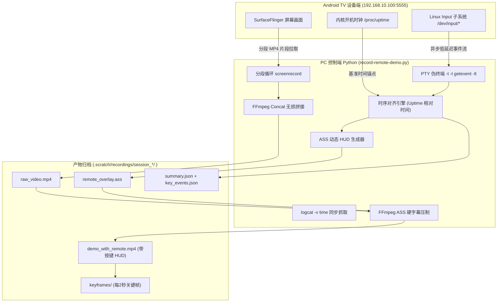

# Android TV 遥控器操作录屏与按键 HUD 动态合成技术指南

本文档系统总结了在 Android TV、智能投影仪（如当贝 DBD5X Pro / MStar / MTK / Amlogic 平台）等大屏设备上进行**操作录屏**、**物理遥控器按键捕获**以及**两者音视频时间线合二为一（按键 HUD 动态浮层渲染）**的技术方案、工程实现与实战避坑经验。

配套落地实现见工程脚本：[`record-remote-demo.py`](file:///home/ldd/lab-dangbei/TvXBrowser/scripts/record-remote-demo.py)。

---

## 目录

- [一、背景与核心痛点](#一背景与核心痛点)
- [二、总体架构与技术流水线](#二总体架构与技术流水线)
- [三、设备端无缝录屏技术（Screen Recording）](#三设备端无缝录屏技术screen-recording)
  - [3.1 原生 screenrecord 的硬性限制与对策](#31-原生-screenrecord-的硬性限制与对策)
  - [3.2 分段录制循环与无损合并](#32-分段录制循环与无损合并)
  - [3.3 优雅退出与防损坏机制](#33-优雅退出与防损坏机制)
- [四、物理遥控器按键捕获技术（Key Event Logging）](#四物理遥控器按键捕获技术key-event-logging)
  - [4.1 为什么放弃应用层按键监听](#41-为什么放弃应用层按键监听)
  - [4.2 底层 getevent 与 PTY 伪终端非阻塞采集](#42-底层-getevent-与-pty-伪终端非阻塞采集)
  - [4.3 字符名与 Hex 原始码双模兼容解析](#43-字符名与-hex-原始码双模兼容解析)
  - [4.4 友好语义化按键映射](#44-友好语义化按键映射)
- [五、时钟对齐：毫秒级音画按键同步（Clock Synchronization）](#五时钟对齐毫秒级音画按键同步clock-synchronization)
  - [5.1 为什么不能用 PC 墙上时间戳](#51-为什么不能用-pc-墙上时间戳)
  - [5.2 基于内核 Uptime 的单调时间锚点](#52-基于内核-uptime-的单调时间锚点)
- [六、合二为一：ASS 字幕与按键 HUD 高级合成（Synthesis & Overlay）](#六合二为一ass-字幕与按键-hud-高级合成synthesis--overlay)
  - [6.1 为什么选择 ASS 字幕而非 FFmpeg drawtext](#61-为什么选择-ass-字幕而非-ffmpeg-drawtext)
  - [6.2 HUD 样式设计与状态机算法](#62-hud-样式设计与状态机算法)
  - [6.3 最终合成流水线（FFmpeg Pipeline）](#63-最终合成流水线ffmpeg-pipeline)
  - [6.4 自动化关键帧截取与多维归档](#64-自动化关键帧截取与多维归档)
- [七、脚本使用指南与归档目录规范](#七脚本使用指南与归档目录规范)

---

## 一、背景与核心痛点

在电视（TV）与智能投影设备开发中，用户交互高度依赖物理遥控器（红外或蓝牙 BLE）：
1. **无触摸反馈**：移动设备录屏时可开启系统“显示点按操作反馈（Show taps）”，观众一眼能看清用户操作；但 TV 平台没有任何触摸点，仅靠焦点在卡片间跳转。
2. **难以界定 Bug 根因**：如果录屏中画面静止或发生意外滑动，仅凭视频无法区分是**遥控器按键无响应（丢键）**、**网页/应用层发生假死/死锁**，还是**用户根本没有按键**。
3. **汇报与演示成本高**：在展示复杂交互（如长按快进、连续按键导航、模态窗拦截、详情页回退）时，单纯录制屏幕画面无法给评审人员清晰的“按键-响应”因果感知。

因此，我们需要一种**非侵入式、跨应用层、且能精确对齐时钟**的自动化工具，将**屏幕画面**与**物理遥控器按键**合二为一，生成自带专业遥控器 HUD 浮层的演示与排障视频。

---

## 二、总体架构与技术流水线

整个录制与合成系统分为四个核心阶段：



---

## 三、设备端无缝录屏技术（Screen Recording）

### 3.1 原生 `screenrecord` 的硬性限制与对策

Android 系统内置的 `/system/bin/screenrecord` 能够通过硬件编码器高效捕获屏幕，但在 TV/投影大屏上有三大硬性限制：

| 限制 / 现象 | 产生根因 | 解决方案 |
| :--- | :--- | :--- |
| **单次录制上限 180 秒** | 谷歌原生硬编码的时间保护限制，超时自动断开退出。 | 建立**分段录制循环机制**，录完一段立即启动下一段，后期使用 FFmpeg 无损合并。 |
| **硬件编码器报错（如 `-38`）** | 大屏芯片（如 MStar / MTK）在默认 1080p/高帧率下硬编 Buffer 溢出或能力受限。 | 降维并锁定为高稳定性规格：`--size 1280x720 --bit-rate 8M --verbose`。720p 对于文字和卡片依然极度锐利，但硬编稳定性大幅提升。 |
| **录屏文件损坏（0 字节）** | 外部直接发送 `kill -9` 杀掉进程，导致 MP4 文件的 `moov` atom（元数据索引）未被写入。 | **严禁 kill -9**！必须向目标进程发送 `kill -2` (SIGINT)，留出时间让编码器刷新缓冲区并写入 MP4 头。 |

### 3.2 分段录制循环与无损合并

在 [`SessionRecorder._record_screen_loop()`](file:///home/ldd/lab-dangbei/TvXBrowser/scripts/record-remote-demo.py#L174-L194) 中，采用分段循环：
```python
remote_mp4 = f'/sdcard/tvx_rec_{segment}.mp4'
cmd = ['adb', '-s', DEVICE, 'shell', f'screenrecord --verbose --size 1280x720 --bit-rate 8M {remote_mp4}']
proc = subprocess.Popen(cmd, ...)
```

录制终止后，将设备上的片段 `segment_0.mp4`, `segment_1.mp4` 等批量 `adb pull` 到主机。通过编写 `segments.txt`：
```text
file 'segment_0.mp4'
file 'segment_1.mp4'
```
使用 FFmpeg Concat Demuxer 进行**无损流复制合并**（瞬间完成，无需重新编解码）：
```bash
ffmpeg -y -f concat -safe 0 -i segments.txt -c copy raw_video.mp4
```

### 3.3 优雅退出与防损坏机制

停止录屏时：
1. 先向目标进程发送 `SIGINT`（信号 2）：
   ```python
   run_adb('shell', 'killall -2 screenrecord || pkill -2 screenrecord', check=False)
   ```
2. 等待进程正常终止并刷新文件头（设置合理的 `wait(timeout=5)`），然后再执行 `adb pull`。
3. 录制前先自动执行清理：`rm -f /sdcard/tvx_rec_*.mp4`，杜绝历史脏文件干扰。

---

## 四、物理遥控器按键捕获技术（Key Event Logging）

### 4.1 为什么放弃应用层按键监听

传统 Android 测试往往在应用内重写 `Activity.onKeyDown()` 或注入 Accessibility 辅助服务，但在排障场景下这存在致命缺陷：
- **无法捕获全局键**：系统 HOME 键、部分设备的长按菜单键、输入法弹出时的按键无法截获。
- **失焦与死锁丢包**：当页面卡顿、UI 线程发生 ANR，或者因弹窗导致焦点漂移到系统层时，应用层按键监听彻底失效，而这些恰恰是排查中最需要保留的现场证据！

### 4.2 底层 `getevent` 与 PTY 伪终端非阻塞采集

必须下沉到 Linux 内核输入子系统层，监听 `/dev/input/event*`：
```bash
adb shell getevent -lt
```

> [!WARNING]
> **关键避坑：ADB 与标准输入/输出的行缓冲阻塞问题**
> 如果直接使用 `subprocess.Popen(['adb', 'shell', 'getevent', '-lt'], stdout=subprocess.PIPE)`，由于是非交互式终端，管道会开启高容量缓冲区（通常 4KB~8KB），导致遥控器按键发生几秒甚至几十秒后 Python 才读出，产生致命时延！

**解决方案：分配 PTY 伪终端**
在 [`record-remote-demo.py:L117-L165`](file:///home/ldd/lab-dangbei/TvXBrowser/scripts/record-remote-demo.py#L117-L165) 中，使用 Python 原生 `pty.openpty()` 创建伪终端：
```python
master, slave = pty.openpty()
proc = subprocess.Popen(
    ['adb', '-s', DEVICE, 'shell', '-t', '-t', 'getevent', '-lt'],
    stdin=slave,
    stdout=slave,
    stderr=slave,
    close_fds=True
)
os.close(slave)

# 结合 select 进行非阻塞微秒级事件轮询
while not self.stop_event.is_set():
    r, _, _ = select.select([master], [], [], 0.2)
    if not r: continue
    chunk = os.read(master, 4096)
    ...
```
`-t -t` 强制分配 TTY，配合 PTY 彻底消除了 ADB 输出缓冲，使按键事件能够**在触发后 1~5ms 内即时推送到主机进程**。

### 4.3 字符名与 Hex 原始码双模兼容解析

不同 TV 芯片平台及定制遥控器驱动的输出格式差异极大：
1. **标准 Linux 键名格式**：
   ```text
   [ 12345.678901] /dev/input/event2: EV_KEY KEY_UP DOWN
   ```
2. **非标/红外遥控器 Hex 格式**（未加载字符映射表）：
   ```text
   [ 12345.678901] /dev/input/event2: 0001 0067 00000001
   ```

因此，必须编写**双正则捕获器**：
```python
# 1. 优先尝试解析符号化格式
m = re.search(r'\[\s*([\d\.]+)\]\s*(/dev/input/\w+):\s*EV_KEY\s+(\w+)\s+(DOWN|UP)', line)
if m:
    ...
else:
    # 2. 兼容解析十六进制原始驱动输入
    m_hex = re.search(r'\[\s*([\d\.]+)\]\s*(/dev/input/\w+):\s*0001\s+([0-9a-fA-F]{4})\s+([0-9a-fA-F]{8})', line)
    if m_hex:
        k_code = m_hex.group(3).lower()
        val = int(m_hex.group(4), 16)
        act = 'DOWN' if val == 1 else ('UP' if val == 0 else 'REPEAT')
        key_name = HEX_KEY_MAP.get(k_code, f'KEY_{k_code}')
```

### 4.4 友好语义化按键映射

定义常用 TV 键位字典，转化为便于人类直观阅读的符号标记：
```python
KEY_MAP = {
    'KEY_UP': '↑ 上',
    'KEY_DOWN': '↓ 下',
    'KEY_LEFT': '← 左',
    'KEY_RIGHT': '→ 右',
    'KEY_ENTER': 'OK 确认',
    'KEY_OK': 'OK 确认',
    'KEY_BACK': '↩ 返回',
    'KEY_MENU': '☰ 菜单',
    'KEY_HOMEPAGE': '⌂ 主页',
    'KEY_VOLUMEUP': '音量+',
    'KEY_VOLUMEDOWN': '音量-',
    'KEY_MUTE': '静音',
}
```

---

## 五、时钟对齐：毫秒级音画按键同步（Clock Synchronization）

将按键叠加到视频上，最核心的技术命题是：**按键事件的发生时刻，如何与视频帧的时间戳严格对应？**

### 5.1 为什么不能用 PC 墙上时间戳

如果使用主机上的 `time.time()` 记录按键时刻并计算相对时间，会导致高达 200ms ~ 1200ms 的严重漂移：
- ADB 网络传输抖动（尤其 Wi-Fi ADB）；
- 宿主机多线程/进程调度的延迟；
- 设备端 `screenrecord` 启动到第一帧画面硬件开始编码的时间无法通过外部精确感知。

### 5.2 基于内核 Uptime 的单调时间锚点

`getevent -lt` 输出的第一列是**设备端内核单调启动时间戳（Kernel Uptime）**：
```text
[ 56123.456789] /dev/input/event1: EV_KEY KEY_DOWN DOWN
  ^^^^^^^^^^^^
  精确到微秒的内核系统开机时钟
```

**同步方案**：
1. 启动录制循环的瞬间，通过 ADB 查询一次设备基准开机时间：
   ```bash
   adb shell cat /proc/uptime
   # 输出: 56120.125 123456.78
   ```
   得到原点 `start_uptime = 56120.125`。
2. 随后所有 `getevent` 事件的相对视频时间点定义为：
   $$\Delta t = \text{ev.uptime} - \text{start\_uptime}$$
3. 若 $\Delta t < 0$（说明启动准备期间有微小按键残留），直接钳位为 `0.0`。

> 这种方法以**设备端硬件内核时钟**作为绝对参考系，彻底消除了 PC 端网络与跨进程通信引入的时间抖动。

---

## 六、合二为一：ASS 字幕与按键 HUD 高级合成（Synthesis & Overlay）

### 6.1 为什么选择 ASS 字幕而非 FFmpeg `drawtext`

在后期将按键可视化合成入视频时，通常有两种思路：
1. **FFmpeg `drawtext` 滤镜**：
   - 缺点：多行文本拼接繁琐，样式标签极度有限，每次更新文本必须拼接复杂的滤镜图（Filtergraph），难以实现现代化的圆角半透明磨砂底框及历史队列排版。
2. **ASS（Advanced SubStation Alpha）高级字幕脚本（推荐）**：
   - 优点：支持独立图层（Layers）、样式表定义、屏幕任意锚定定位（如屏幕左下角）、半透明背景阴影（`BorderStyle: 3`）、以及灵活的行内富文本标签（粗体、变色、字号调节）。可以直接交给 FFmpeg 的 `ass` 滤镜一键压制！

### 6.2 HUD 样式设计与状态机算法

在 [`record-remote-demo.py:L297-L332`](file:///home/ldd/lab-dangbei/TvXBrowser/scripts/record-remote-demo.py#L297-L332) 中，设计了专用的 `RemoteHUD` 样式表：

```ini
[Script Info]
ScriptType: v4.00+
PlayResX: 1280
PlayResY: 720

[V4+ Styles]
Format: Name, Fontname, Fontsize, PrimaryColour, SecondaryColour, OutlineColour, BackColour, Bold, Italic, Underline, StrikeOut, ScaleX, ScaleY, Spacing, Angle, BorderStyle, Outline, Shadow, Alignment, MarginL, MarginR, MarginV, Encoding
Style: RemoteHUD,Source Han Sans CN,22,&H00FFFFFF,&H000000FF,&H00000000,&HA0151515,-1,0,0,0,100,100,0,0,3,4,0,3,30,30,30,1
```

**关键属性解析**：
- `Alignment: 3`：锚定在屏幕**左下角**（避免遮挡主要大屏中央内容）。
- `BorderStyle: 3` & `BackColour: &HA0151515`：自动生成半透明黑色磨砂背景框，无论底层网页是浅色还是深色背景，字迹均极为清晰。
- `Outline: 4`：底板四周填充 Padding。

#### 按键展示状态机与动态截断算法
为了让用户既能看清当前按键，又能看懂连续操作链路，算法设计如下：

```python
# 过滤仅处理按下 (DOWN) 事件
down_events = [e for e in events_list if e['action'] == 'DOWN']
history = []

for i, ev in enumerate(down_events):
    rel_start = max(0.0, ev['uptime'] - start_uptime)
    
    # 动态计算停留时间：单键默认显示 1.5 秒
    # 若在 1.5 秒内发生下一次按键，则平滑截断至下一按键时间（下限保持 0.4 秒防频闪）
    if i + 1 < len(down_events):
        next_rel = max(0.0, down_events[i + 1]['uptime'] - start_uptime)
        rel_end = min(rel_start + 1.5, max(rel_start + 0.4, next_rel))
    else:
        rel_end = rel_start + 1.5

    # 维护长度为 4 的历史按键队列
    k_label = KEY_MAP.get(ev['key'], ev['key'])
    history.append(k_label)
    if len(history) > 4: 
        history.pop(0)
    hist_str = ' → '.join(history[-4:])

    # 组装富文本 ASS 文本行
    text_main = (
        r'{\b1\c&H00FFFF&}遥控按键:  {\b1\c&H00D7FF&}【 ' + k_label + r' 】' +
        r'\N' + 
        r'{\b0\fs18\c&HCCCCCC&}历史: ' + hist_str +
        r'   {\c&H888888&}[' + fmt_time(rel_start) + r']'
    )
    dialogues.append(f'Dialogue: 0,{fmt_time(rel_start)},{fmt_time(rel_end)},RemoteHUD,,0,0,0,,{text_main}')
```

**视觉效果演示**：
```text
┌──────────────────────────────────────────────┐
│ 遥控按键:  【 OK 确认 】                     │
│ 历史: ↑ 上 → ↓ 下 → OK 确认   [0:00:12.45]   │
└──────────────────────────────────────────────┘
```

### 6.3 最终合成流水线（FFmpeg Pipeline）

通过 FFmpeg 滤镜直接加载生成的 `.ass` 字幕并压制输出高质量最终视频：
```bash
ffmpeg -y -i raw_video.mp4 \
    -vf "ass=remote_overlay.ass" \
    -c:v libx264 -preset fast -crf 20 \
    -c:a copy \
    demo_with_remote.mp4
```
- `-preset fast -crf 20`：平衡了压缩速度与极佳的画质。
- 硬字幕压制后，任何标准播放器、浏览器或社交平台均可直接播放，无需额外挂载字幕文件。

### 6.4 自动化关键帧截取与多维归档

在压制完视频后，脚本自动提取关键帧序列（每 2 秒 1 帧），用于无视频环境下的快速文档嵌入与预览：
```bash
ffmpeg -y -i demo_with_remote.mp4 -vf fps=1/2 -q:v 2 keyframes/frame_%03d.jpg
```
同时，将完整的操作元数据与统计指标写入 `summary.json`：
```json
{
  "session_name": "session_20260908_130008",
  "final_video": "/home/ldd/.../demo_with_remote.mp4",
  "duration_seconds": 105.4,
  "total_key_events": 142,
  "total_presses": 71,
  "key_counts": {
    "↓ 下": 32,
    "↑ 上": 18,
    "OK 确认": 12,
    "↩ 返回": 9
  }
}
```

---

## 七、脚本使用指南与归档目录规范

### 1. 运行环境前置要求
- Python 3.8+
- ADB 工具链，确保已连接设备（可通过 `export TVX_ADB_SERIAL=192.168.10.100:5555` 指定）
- FFmpeg（需支持 `--enable-libass`，一般主流系统的 ffmpeg 均内置）

### 2. 启动录制
进入项目根目录直接运行脚本：
```bash
# 开启录制 session，自动清理设备残余，监听屏幕与按键
python3 scripts/record-remote-demo.py
```
终端会实时打印当前捕获到的遥控器按键信息：
```text
[*] Initializing recording for device: 192.168.10.100:5555
[*] Base device uptime: 56120.125s
[+] Recording started successfully! Watching for remote actions...
[*] Starting screenrecord segment 0 -> /sdcard/tvx_rec_0.mp4
  [KEY EVENT] +  2.45s | ↓ 下     | DOWN
  [KEY EVENT] +  2.58s | ↓ 下     | UP
  [KEY EVENT] +  4.12s | OK 确认  | DOWN
```

### 3. 停止与合成
有两种方式停止录屏：
- **前台交互式**：直接在终端按下 `Ctrl + C`；
- **后台控制方式**：在另一终端执行：
  ```bash
  python3 scripts/record-remote-demo.py stop
  ```
脚本捕获到信号后会自动完成：分段拉取 → 视频拼接 → ASS 字幕生成 → FFmpeg 硬压制 → 抽帧 → 生成 JSON 报告。

### 4. 产物目录结构规范
所有产物按时间戳隔离保存在 `.scratch/recordings/` 目录下（受 `.gitignore` 保护）：
```text
.scratch/recordings/session_20260908_130008/
├── raw_video.mp4          # 原始无损拼接录屏 (无字幕)
├── demo_with_remote.mp4    # 最终产物：带遥控器 HUD 浮层的演示视频
├── remote_overlay.ass     # 自动生成的 ASS 动态字幕源文件
├── key_events.json        # 结构化微秒级按键事件数组 (含 uptime 及动作)
├── events.raw             # getevent 原始标准输出日志
├── logcat.log             # 录制期间同步抓取的 Android Logcat
├── segments.txt           # 分段录屏合并清单
├── summary.json           # 本次 Session 概要指标与按键频次统计
└── keyframes/             # 自动抽取的每 2 秒关键帧图片序列
    ├── frame_001.jpg
    ├── frame_002.jpg
    └── ...
```
